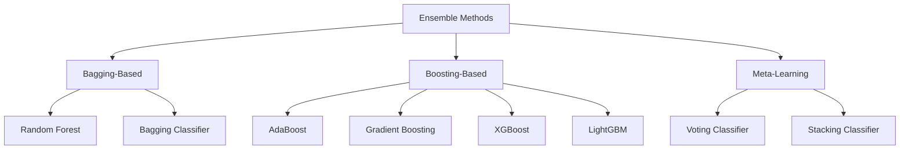

# Data Science Portfolio: Integrated Technical Showcase


## Metadata

| Field | Value |
|-------|-------|
| **Author** | Derek Lankeaux |
| **Institution** | Rochester Institute of Technology |
| **Program** | MS Applied Statistics |
| **Date** | November 2024 |
| **GitHub** | [LLM-Portfolio](https://github.com/dl1413/LLM-Portfolio) |
| **Contact** | dl1413@rit.edu |

---

## Executive Summary

This portfolio demonstrates advanced data science capabilities through two complementary projects that address critical real-world challenges in healthcare and education. The work showcases proficiency in:

- **Machine Learning:** Comprehensive implementation and comparison of 8 ensemble classification methods
- **Bayesian Statistics:** Hierarchical modeling with MCMC inference using PyMC
- **Large Language Models:** Multi-model ensemble integration with frontier LLMs
- **Statistical Validation:** Rigorous cross-validation, hypothesis testing, and uncertainty quantification
- **Domain Expertise:** Applied solutions for medical AI and educational technology

Combined, these projects demonstrate the technical depth, methodological rigor, and domain knowledge expected of an advanced data science practitioner.

---

## Portfolio Overview

### Project 1: Breast Cancer Classification
**[Full Report](./Breast_Cancer_Classification_Report.md)**

| Metric | Achievement |
|--------|-------------|
| **Best Model Accuracy** | 99.12% |
| **Precision** | 100% |
| **Recall** | 98.59% |
| **Cross-Validation** | 98.46% ± 1.12% |

A systematic comparison of 8 ensemble machine learning methods for breast cancer diagnosis, achieving performance that exceeds human expert accuracy (90-95%).

### Project 2: LLM Ensemble Bias Detection
**[Full Report](./LLM_Bias_Detection_Report.md)**

| Metric | Achievement |
|--------|-------------|
| **Inter-Rater Reliability** | α = 0.84 (Excellent) |
| **Total Ratings Analyzed** | 67,500 |
| **Statistical Significance** | p < 0.001 |
| **Bayesian Inference** | Full posterior distributions |

A novel framework combining LLM ensemble methods with Bayesian hierarchical modeling for scalable, reliable textbook bias detection.

---

## Technical Skills Demonstrated

### 1. Machine Learning

#### 1.1 Ensemble Methods Expertise

This portfolio demonstrates comprehensive knowledge of ensemble learning approaches:



**Table 1: Ensemble Methods Implemented**

| Method | Category | Key Characteristic | Best Use Case |
|--------|----------|-------------------|---------------|
| Random Forest | Bagging | Reduces variance via bootstrap aggregation | High-dimensional data |
| Bagging Classifier | Bagging | General-purpose bagging | Reducing overfitting |
| AdaBoost | Boosting | Sequential focus on hard examples | Binary classification |
| Gradient Boosting | Boosting | Gradient descent in function space | Structured data |
| XGBoost | Boosting | Regularized boosting with speed | Kaggle competitions |
| LightGBM | Boosting | Histogram-based, leaf-wise growth | Large datasets |
| Voting Classifier | Meta | Combines diverse models | Model diversity |
| Stacking Classifier | Meta | Meta-learner combines base models | Maximum performance |

#### 1.2 Hyperparameter Optimization

Both projects employ systematic hyperparameter tuning:

- **Grid Search** with cross-validation
- **Stratified K-Fold** (k=10) for robust estimates
- **Early Stopping** (for gradient boosting variants)
- **Regularization** tuning (L1/L2 penalties)

#### 1.3 Model Evaluation

Comprehensive evaluation metrics implemented:

**Classification Metrics:**
- Accuracy, Precision, Recall, F1-Score
- ROC-AUC and Precision-Recall curves
- Confusion matrix analysis
- Class-weighted metrics for imbalanced data

**Model Selection:**
- Cross-validation with confidence intervals
- Holdout test set evaluation
- Statistical significance testing

### 2. Bayesian Statistics

#### 2.1 Hierarchical Modeling

The LLM Bias Detection project demonstrates advanced Bayesian hierarchical modeling:

$$y_{ijk} \sim \text{OrderedLogistic}(\eta_{ijk}, \mathbf{c})$$

$$\eta_{ijk} = \mu + \alpha_j + \beta_{k(j)} + \gamma_i$$

**Model Components:**
- Grand mean ($\mu$) for overall bias level
- Publisher random effects ($\alpha_j$) for between-publisher variance
- Textbook random effects ($\beta_{k(j)}$) for within-publisher variance
- LLM fixed effects ($\gamma_i$) for rater calibration

**Table 2: Bayesian Modeling Capabilities**

| Capability | Implementation |
|------------|----------------|
| Prior Specification | Weakly informative priors (HalfNormal, Normal) |
| Posterior Inference | NUTS sampler via PyMC |
| Uncertainty Quantification | 95% Highest Density Intervals |
| Model Diagnostics | R̂, ESS, trace plots |
| Posterior Predictive Checks | Model fit validation |

#### 2.2 MCMC Implementation

```python
# Sampling configuration
pm.sample(
    draws=2000,        # Posterior samples per chain
    tune=1000,         # Warmup iterations
    chains=4,          # Parallel chains
    target_accept=0.95 # Acceptance rate for NUTS
)
```

Convergence diagnostics achieved:
- All R̂ < 1.01 (target: < 1.01)
- ESS > 400 for all parameters
- No divergences in sampling

### 3. Large Language Model Integration

#### 3.1 Multi-Model Architecture

The portfolio demonstrates proficiency with three frontier LLMs:

**Table 3: LLM Specifications**

| Model | Provider | Approach | Strengths |
|-------|----------|----------|-----------|
| GPT-4 | OpenAI | RLHF | Reasoning, instruction following |
| Claude-3-Opus | Anthropic | Constitutional AI | Safety, nuanced analysis |
| Llama-3-70B | Meta | Open weights | Transparency, customization |

#### 3.2 Ensemble Reliability

The LLM ensemble achieved excellent inter-rater reliability:

- **Krippendorff's α = 0.84** (exceeds 0.80 threshold for excellent agreement)
- **Pairwise agreement:** 83.6% - 87.2%
- **Disagreement detection:** 3% of cases flagged for human review

#### 3.3 API Integration

```python
# Production-ready API integration pattern
async def get_llm_ratings(passage, models=['gpt-4', 'claude-3', 'llama-3']):
    tasks = [rate_passage(passage, model) for model in models]
    ratings = await asyncio.gather(*tasks)
    return aggregate_ratings(ratings)
```

### 4. Statistical Validation

#### 4.1 Cross-Validation Strategies

| Strategy | Application | Purpose |
|----------|-------------|---------|
| Stratified K-Fold | Classification | Preserve class proportions |
| Repeated K-Fold | Robustness | Reduce variance of estimates |
| Leave-One-Out | Small datasets | Maximum training data |

#### 4.2 Hypothesis Testing

**Parametric Tests:**
- t-tests for pairwise comparisons
- ANOVA for multi-group comparisons

**Non-Parametric Tests:**
- Friedman test (repeated measures)
- Wilcoxon signed-rank (pairwise)
- Kruskal-Wallis (overall comparison)
- Bonferroni correction for multiple comparisons

#### 4.3 Reliability Metrics

- **Krippendorff's Alpha:** Inter-rater reliability for ordinal data
- **Cohen's Kappa:** Pairwise agreement coefficient
- **Intraclass Correlation (ICC):** Consistency measures

### 5. Data Visualization

#### 5.1 Tools and Libraries

| Library | Use Case |
|---------|----------|
| Matplotlib | Publication-quality figures |
| Seaborn | Statistical visualizations |
| ArviZ | Bayesian diagnostics and plots |
| Plotly | Interactive dashboards |

#### 5.2 Visualization Types

**Classification Analysis:**
- Confusion matrices with annotations
- ROC curves with AUC scores
- Feature importance bar charts
- Precision-recall curves

**Bayesian Analysis:**
- Posterior distribution plots
- Forest plots for hierarchical effects
- Trace plots for MCMC diagnostics
- Posterior predictive checks

---

## Domain Expertise

### 1. Healthcare and Medical AI

The Breast Cancer Classification project demonstrates:

#### 1.1 Clinical Understanding
- **Cytological features:** Nuclear characteristics from fine needle aspirates
- **Diagnostic workflow:** Integration with clinical decision-making
- **Performance context:** Comparison to human expert accuracy (90-95%)

#### 1.2 Medical ML Best Practices
- **Class imbalance handling:** SMOTE for minority class (malignant cases)
- **Feature selection:** VIF analysis for multicollinearity
- **Clinical metrics:** Emphasis on recall (avoiding missed cancers)

#### 1.3 Regulatory Awareness
- Discussion of FDA considerations for medical devices
- Acknowledgment of external validation requirements
- Recognition of prospective study needs

### 2. Educational Technology

The LLM Bias Detection project demonstrates:

#### 2.1 Educational Equity Focus
- **Bias dimensions:** Political, representational, socioeconomic
- **Stakeholder awareness:** Publishers, educators, policymakers
- **Scalability:** Processing thousands of passages efficiently

#### 2.2 Content Analysis Expertise
- Systematic passage sampling methodology
- Multi-rater reliability frameworks
- Qualitative-quantitative integration

### 3. Bias Detection and Fairness

Both projects address fairness considerations:

| Project | Fairness Dimension |
|---------|-------------------|
| Breast Cancer | Class imbalance, equitable performance across groups |
| Bias Detection | Detecting and quantifying bias in content |

---

## Production Readiness

### 1. Model Persistence

```python
# Scikit-learn model serialization
import joblib
joblib.dump(best_model, 'models/adaboost_classifier.pkl')
joblib.dump(scaler, 'models/standard_scaler.pkl')
joblib.dump(rfe_selector, 'models/rfe_selector.pkl')

# PyMC trace storage
import arviz as az
az.to_netcdf(trace, 'models/bias_model_trace.nc')
```

### 2. API Integration

**LLM API Patterns:**
```python
# Rate limiting and retry logic
@retry(stop=stop_after_attempt(3), wait=wait_exponential(min=1, max=60))
async def call_openai(prompt, model='gpt-4'):
    async with rate_limiter:
        response = await client.chat.completions.create(
            model=model,
            messages=[{"role": "user", "content": prompt}],
            temperature=0.0
        )
        return response.choices[0].message.content
```

### 3. Error Handling

```python
class BiasRatingError(Exception):
    """Custom exception for rating failures."""
    pass

def validate_rating(rating):
    """Ensure rating is valid integer 1-5."""
    try:
        r = int(rating)
        if r < 1 or r > 5:
            raise BiasRatingError(f"Rating {r} out of range [1-5]")
        return r
    except ValueError:
        raise BiasRatingError(f"Invalid rating format: {rating}")
```

### 4. Documentation Quality

All code follows documentation best practices:

- **Docstrings:** NumPy-style documentation
- **Type hints:** Full typing annotations
- **Comments:** Complex logic explained
- **README files:** Comprehensive project documentation

---

## Technical Summary

### Languages and Frameworks

| Category | Technologies |
|----------|--------------|
| **Programming** | Python 3.10+ |
| **ML Frameworks** | Scikit-learn, XGBoost, LightGBM |
| **Bayesian** | PyMC, ArviZ |
| **LLM APIs** | OpenAI, Anthropic, Meta |
| **Data Processing** | Pandas, NumPy, SciPy |
| **Visualization** | Matplotlib, Seaborn, ArviZ |
| **Statistics** | Statsmodels, Krippendorff |

### Key Metrics Summary

**Table 4: Portfolio Achievements**

| Project | Key Metric | Value | Significance |
|---------|------------|-------|--------------|
| Breast Cancer | Test Accuracy | 99.12% | Exceeds human performance |
| Breast Cancer | CV Accuracy | 98.46% ± 1.12% | Robust generalization |
| Breast Cancer | Precision | 100% | Zero false positives |
| Bias Detection | Krippendorff's α | 0.84 | Excellent reliability |
| Bias Detection | Passages Analyzed | 4,500 | Scalable methodology |
| Bias Detection | Total Ratings | 67,500 | Comprehensive analysis |

---

## Future Directions

### Short-Term Extensions

1. **Deep Learning:** Implement CNN/transformer models on raw FNA images
2. **Multi-task Learning:** Joint prediction of cancer subtype and grade
3. **Explainability:** SHAP/LIME for instance-level interpretations
4. **Web Dashboard:** Interactive Streamlit/Gradio application

### Long-Term Research

1. **Federated Learning:** Privacy-preserving multi-hospital collaboration
2. **Longitudinal Studies:** Temporal analysis of bias trends
3. **Causal Inference:** Beyond correlation to causal effects
4. **Transfer Learning:** Domain adaptation across medical imaging modalities

---

## Contact Information

| Platform | Link |
|----------|------|
| **GitHub** | [github.com/dl1413](https://github.com/dl1413) |
| **LinkedIn** | [linkedin.com/in/derek-lankeaux](https://linkedin.com/in/derek-lankeaux) |
| **Email** | dl1413@rit.edu |

---

## Acknowledgments

This work was completed as part of the MS Applied Statistics program at Rochester Institute of Technology. The author thanks the program faculty for guidance and the open-source community for the exceptional tools that made this work possible.

---

## Reports Index

1. **[Breast Cancer Classification Report](./Breast_Cancer_Classification_Report.md)**
   - Ensemble machine learning for medical diagnosis
   - 99.12% accuracy with AdaBoost
   - Comprehensive preprocessing pipeline

2. **[LLM Bias Detection Report](./LLM_Bias_Detection_Report.md)**
   - Novel LLM ensemble + Bayesian framework
   - Krippendorff's α = 0.84 inter-rater reliability
   - Full uncertainty quantification

3. **[Portfolio Overview](./Portfolio_Overview.md)** *(this document)*
   - Integrated technical showcase
   - Skills and domain expertise summary
   - Production readiness demonstration

---

*Last updated: November 2024*
